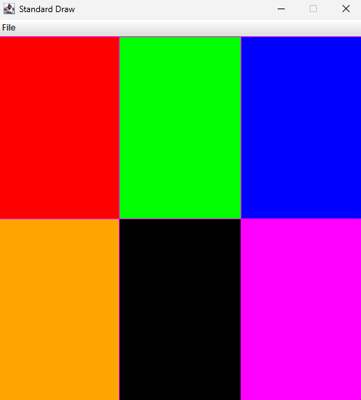

# I2CS_Ex2

Ex2 - Basic Object-Oriented Programming & 2D Maze Algorithms

This is assigment #2 at Ariel University, School of Computer Science, 2026.

The assigment focuses on the introduction of object Oriented Programming,using 2D array as a representation of maps or mazes.

The assigment has 3 main Algorithms which are based of Breadth First Search(BFS).

## ***Files***

*__Interface-__*

    1. Pixel2D - an interface which represents an integer based cooridante.
    
    2. Map2D - an interface which represents a 2D map as a matrix or maze.

*__Classes-__*

    1. Index2D - represents a 2D point, implements Pixel2D.

    2. Map - represents a 2D map or maze as a 2D array of integers, implements Map2D(the main class).

    3. StdDraw -  Standard drawing library. This class provides a basic capability for
    creating drawings with your programs. 
     (https://introcs.cs.princeton.edu/java/stdlib/StdDraw.java.html)

*__Tests-__*

    1. Index2DTest - includes all the  tests for Index2D.

    2. MapTest - includes all the tests for Map.

*__Other-__*

    1. Ex2_GUI - Graphical User Interface for Map2D, has save, load and drawMap functions, uses StdDraw.

    2. map.txt - an example of the file created from creating a certain map and saving it.

## ***Functions***
*__Index2D-__*
    
    1. Index2D(int w, int h) - the standard constructor.

    2. Index2D(Pixel2D other) - Copy constructor.

    3. getX() - returns the x value of the Index.

    3. getY() - returns the y value of the Index.

    4. distance2D(Pixel2D p2) - computes the 2D (Euclidean) distance between two points .

    5. toString() - returns a string representation of the Index[from the form of (x,y)].

    6. equals() - return true or false based on if two Indexes are equal.

*__Map-__*

    1. public Map(int w, int h, int v) - the standard constructor.
    
    2. public Map(int size) - constructor a square map with a width and height of size and each value is zero.

    3. public Map(int[][] data) - Constructs a map from a given 2D array of integers.

    4. init(int w, int h, int v) - Constructs a 2D array of ints, filled with a given value and turn it into a map.

    5. init(int[][] arr) - Constructs a 2D array of ints from a given array and turns it into a map.

    6. getMap() - returns a deep copy of the 2D array of integers that represents the map.

    7. getWidth() - returns the width of the current(this) map.

    8. getHeight() - returns the height of the current(this) map.

    9. getPixel(int x, int y) - returns the value of the map at the given coordinates.

    10. getPixel(Pixel2D p) - returns the value fo the map at the given Pixel2D p. 

    11. setPixel(int x,int y , int v) - sets the integer v to be the value of the map at the given coordinates x,y.

    12. setPixel(Pixel2D p, int v) - setst the sets the integer v to be the value of the map at the given Pixel2D p.

    13. isInside(Pixel2D p) - returns true or false based on if the given Pixel2D p is inside the map.

    14. sameDimensions(Map2D p) - return true of false based on if the given map has the same dimensions.

    15. addMap2D(Map2D p) - adds the values of the given map to the value of the current map.

    16. mul(double scalar) - multiplies each value in the map by the given scalar.

    17. rescale(double sx, double sy) - rescales the current map, rescales the height by sx and the width by sy, note that some values can be erased if you rescale.

    18. drawCircle(Pixel2D center, double rad, int color) - draws a circle of the given color inside the map, the circle will have the given Pixel2D center as the center and the given rad as the radius.

    19. drawLine(Pixel2D p1, Pixel2D p2, int color) - draws a line of the given color, the line will bet from the coordinates of Pixel2D p1 to the coordinates of Pixel2D p2.

    20. drawRect(Pixel2D p1, Pixel2D p2, int color) - draws a rectangle from the coordinates of Pixel2D p1 to the coordinates of Pixel2D p2, the rectangle will be of the given color.

    21. equals(Object ob) - if the given isn't an instanceof Map2D will automatically return false otherwise if it is return true or false based on if the given maps has the same dimensions and values as the current map.

    22. fill(Pixel2D xy, int new_v,  boolean cyclic) - returns the numbers of filled pixels when filling the map with the color of new_v from the coordinates of Pixel2D xy, takes into account if the map is cyclic or not.

    23. floodFill(Pixel2D xy, int new_v, int old_v, boolean cyclic) - returns the numbers of filled pixels when filling the map with the color of new_v from the coordinates of Pixel2D xy, takes into account if the map is cyclic or not, the diffrence from fill is that fill finds the color we want to fill and then calls this function, this function uses BFS to set every old color that connects, to the new color.

    24. shortestPath(Pixel2D p1, Pixel2D p2, int obsColor, boolean cyclic) - returns an array of Pixel2D that represents the shortest path to get from Pixel2D p1 to Pixel2D p2 when avoiding all the pixels that have the color obsColor, uses BFS to calculate the path.

    25. allDistance(Pixel2D start, int obsColor, boolean cyclic) - returns a map that the value of each pixel is it's number of steps in the shortest path from Pixel2D start, each None accessible entries are with marked -1, avoids the pixels of the color obsColor.

    26. new_fill(Pixel2D p1,Pixel2D p2,boolean cyclic) - works the same as fill + flood fill, the only difference is that now we count each step in each path , by saving in the queue its coordinates with their count, and it returns the number of steps it did until it got to p2 if it didn't make it to p2 return -1, uses BFS.

    27. find_path(int count, int x, int y, boolean cyclic) - return an array of Index2D that represents the path to reach from the maximum value in the map to zero, if there is no path return 01, uses BFS.

*__Ex2_GUI-__*

    1. drawMap(Map2D map) - uses StdDraw to draw the given map.

    2. loadMap(String mapFileName) - loads a map from a given file.

    3. saveMap(Map2D map, String mapFileName) - saves a given map in a file(if no file names like given creates one).

## ***BFS EXPLANATION***
    BFS(Breadth-First Search) is an algorithm used to traverse or search, It explores nodes level by level, meaning it visits the nodes itself then it's neighbours and then their neighbours.
    In the assigment i used BFS with queue, it works by:
    1. puting the starting node in the queue 
    2. while the queue isn't empty 
        A. remove the front node
        B. visit it
        C. add all it's neighbors(unvisited neighbours)
        D. mark neighbors visited

## ***Result***
__This is the gui after all the functions have been written and completed,
given the map__

{-65536,-16711936,-16776961}

{-23296,1,-65281}

__of course each number represents a color,__

(-65536) is red

(-16711936) is green 

(-16776961) is blue

(-23296) is orange

(1) is black 

(-65281) is pink 

